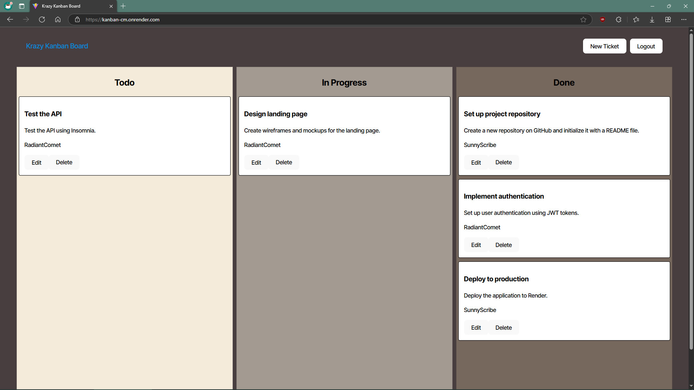

# Kanban-CM

## Description

Kanban-CM is a web-based software application where the user can track production issues for any kind of project. Create tickets that describe production issues, and then move the tickets between "Todo", "In Progress", and "Done" status. Only authenticated users may view or modify the status tickets. When a user attemps to login, the server compares the provided password against the salted and hashed password record for the specified user in the server database using bcrypt. Once authenticated, the user recieves a JWT from the server that is used to authorize interactions with the saved issue tickets.

## Table of Contents

- [Installation](#installation)
- [Usage](#usage)
- [Contributing](#contributing)
- [Tests](#tests)
- [Questions](#questions)
- [License](#license)

## Installation

Use your favorite package manager, such as Node Package Manager, to install the required dependancy packages. Use your prefered SQL database management system, such as PostgreSQL, to create a database for the Kanban-CM software to interact with. Transpile the Kanban-CM server and client typescript code into javascript. Node Package Manager can use the scripts defined in the package.json to perform this task. After transpiling the code, the "npm run seed" script can seed the SQL database with user accounts and project issue tickets.

## Usage

Startup the Kanban-CM server with the "npm run start" script in the top level package.json. Login to Kanban-CM and click the on-screen buttons to manage project ticket status. Follow the link below to see the deployed web app. The app may take some time to load because it is hosted on a free option at "www.render.com".

[https://kanban-cm.onrender.com](https://kanban-cm.onrender.com)

## Contributing

Contact Christopher Makousky for inquiries about making contributions.

## Tests

Click the buttons on the screen to test the client functions. Use your favorite API development platform, such as Insomnia, to test the server functions.

    GIVEN a Kanban board with a secure login page

        WHEN I load the login page
        THEN I am presented with form inputs for username and password

        WHEN I enter my valid username and password
        THEN I am authenticated using JSON Web Tokens (JWT) and redirected to the main Kanban board page

        WHEN I enter an invalid username or password
        THEN I am presented with an error message indicating that the credentials are incorrect

        WHEN I successfully log in
        THEN a JWT is stored securely in the client's local storage for subsequent authenticated requests

        WHEN I log out
        THEN the JWT is removed from the client's local storage and I am redirected to the login page

        WHEN I try to access the Kanban board page without being authenticated
        THEN I am redirected to the login page
        
        WHEN I remain inactive for a defined period
        THEN my session expires, the JWT is invalidated, and I am redirected to the login page upon my 
        next action

## Questions

https://github.com/CMakousky

christopher.makousky@gmail.com

## License

MIT License